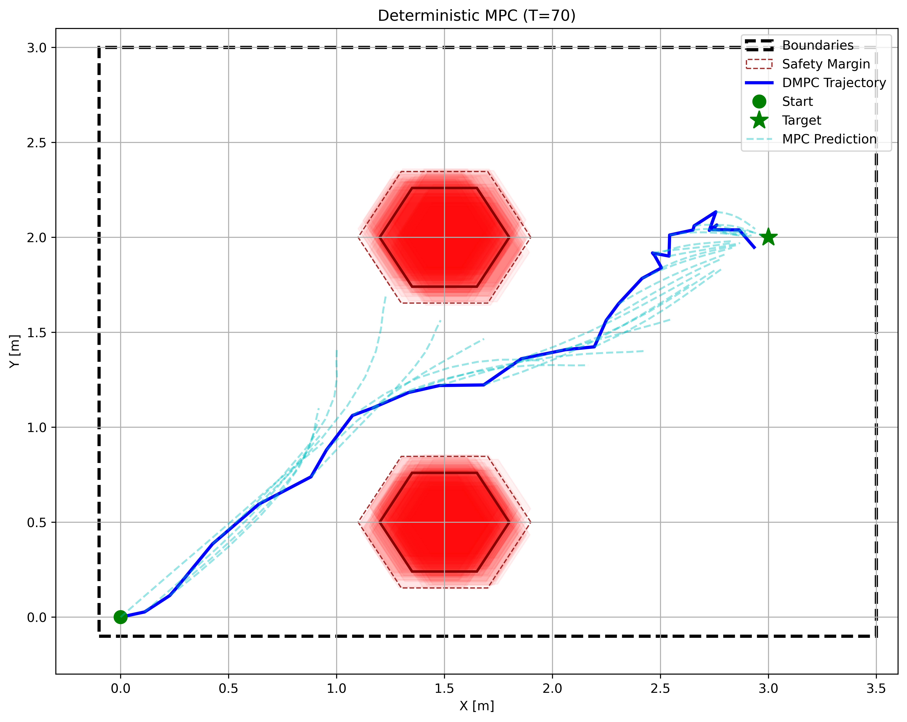
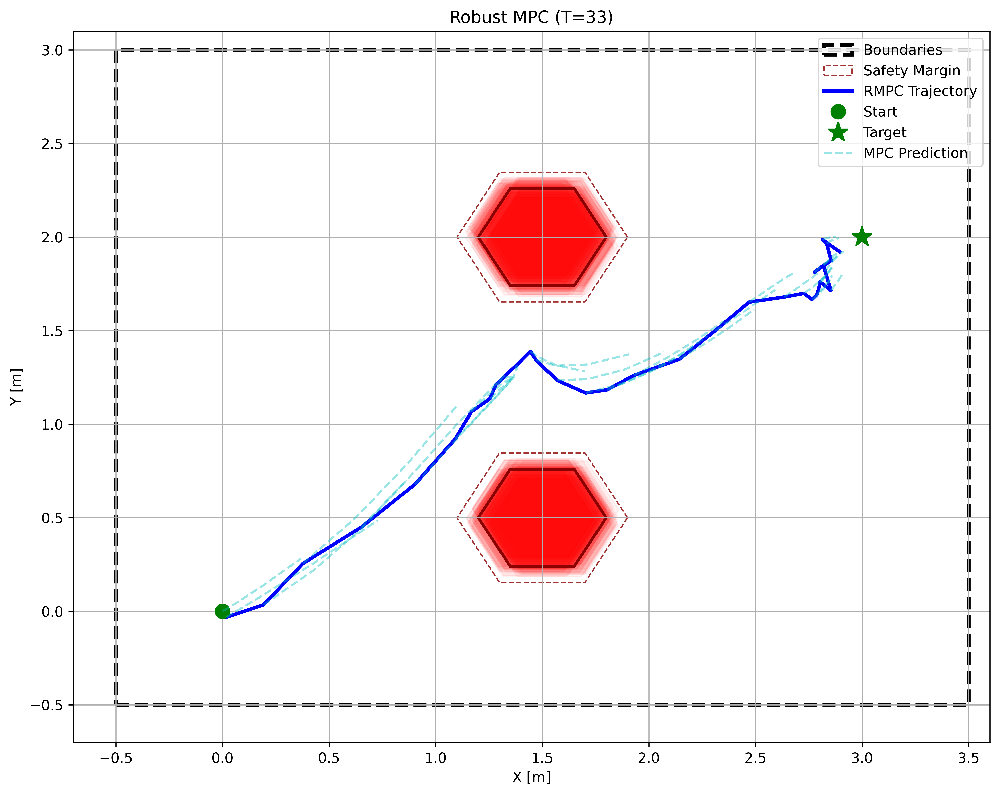
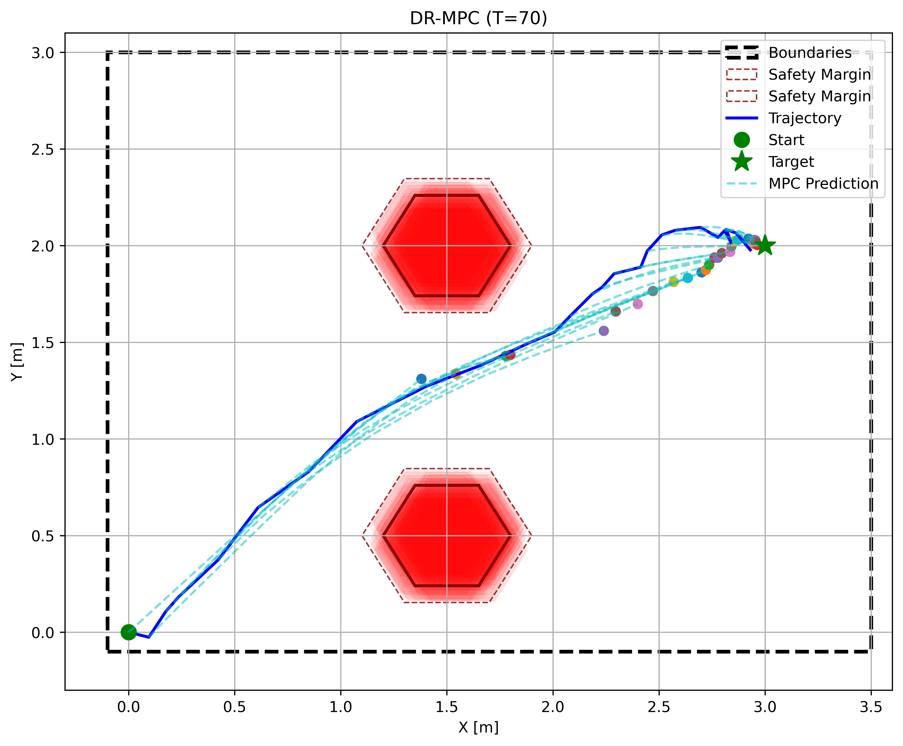
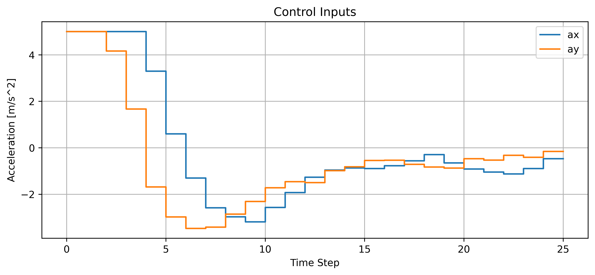
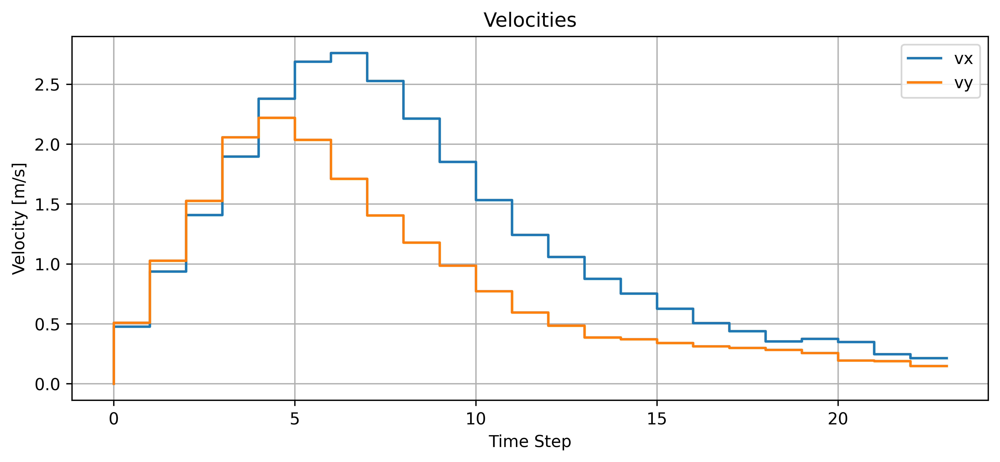
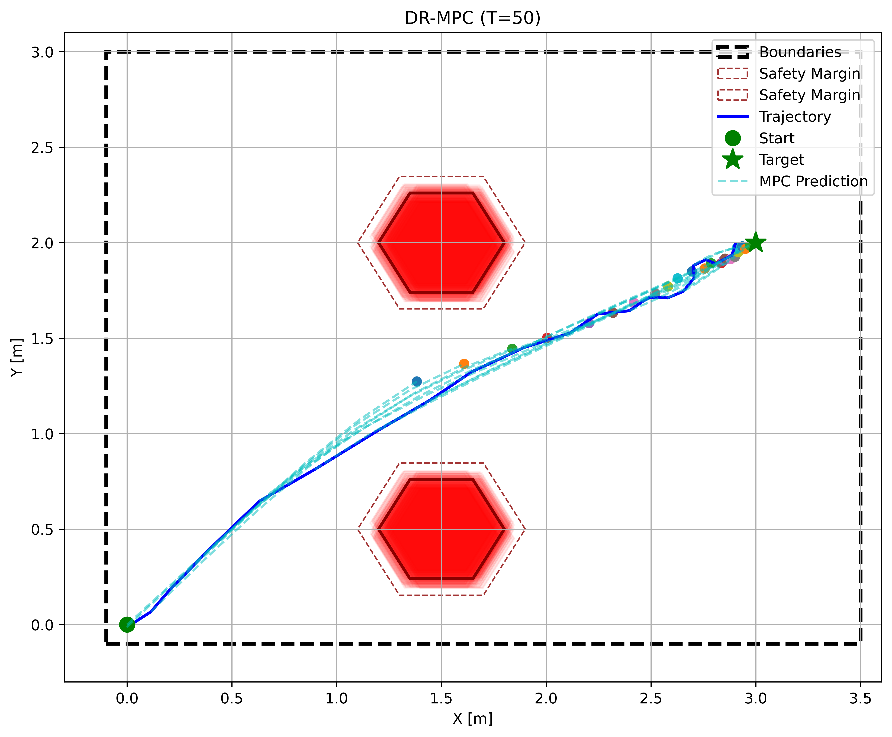
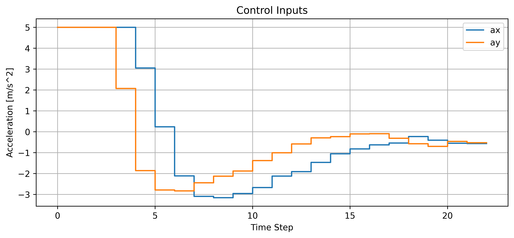

# DR-MPC for Safe Motion Planning

This repository contains the implementation of various Model Predictive Control (MPC) strategies for safe motion planning, ranging from deterministic baselines to Distributionally Robust (DR) approaches.

## 1. Deterministic MPC
A standard MPC implementation that assumes perfect model knowledge and a static, known environment and calculates the control action accordingly, but when applied, disturbances in obstacle positions and system dynamics can occur.

* **Source Code:** [dmpc.py](dmpc.py)
* **Resulting Plot:**
    

---

## 2. Robust MPC
An MPC formulation designed to handle bounded uncertainties by optimizing for the worst-case scenario within a set of possible disturbances.

* **Source Code:** [rmpc.py](rmpc.py)
* **Resulting Plot:**
    

---

## 3. DR-MPC without ADF
Distributionally Robust MPC (DR-MPC) is implemented without an Affine Disturbance Feedback policy when both uncertainties in obstacle position and state dynamics are present simultaneously. This method optimizes performance across a set of probability distributions to ensure safety under distributional uncertainty.

* **Source Code:** [dr_mpc_no_adf.py](drmpc_comb_no_adf.py)
* **Resulting Plots (Trajectories, Control, and Velocities):**
    
    
    

---

## 4. DR-MPC with ADF
The Distributionally Robust MPC implementation uses an Affine Disturbance Feedback (ADF) when both uncertainties in obstacle position and state dynamics are present simultaneously. It improves feedback and safety in complex environments.

* **Source Code:** [drmpc_adf.py](drmpc_comb_adf.py)
* **Resulting Plots (Trajectories, Control, and Velocities):**
    
    
    
